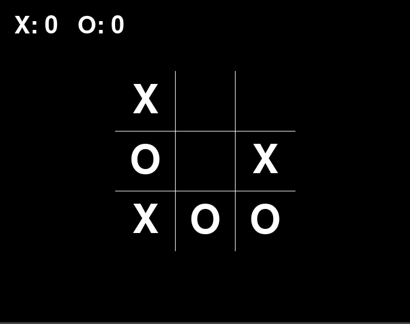

<h1> Tic Tac Toe Game Pygame </h1> 

 This repository contains Tic Tac Toe Game written in python using pygame module. 

 This game supports 1 player mode (vs ai) and 2 players mode 

  

  

<h2> Play </h2>
<ol>
  <li> Make sure you have pip and python installed </li>
  <li> Clone this repo </li>
  <li> run pip install -r requirements.txt in your terminal/cmd </li>
  <li> run python main.py in your terminal/cmd </li>
